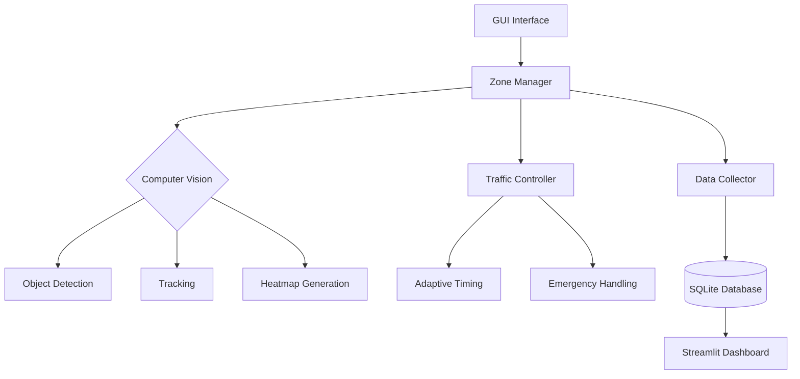

# 🚦 Traffic Vision

## 🌟 **Overview**
Traffic Vision is a comprehensive AI-powered traffic management system that uses **computer vision, adaptive control systems, and IoT integration** to enhance road safety and optimize traffic flow. It provides **real-time accident detection**, **emergency vehicle prioritization**, **dynamic traffic light control**, and **heatmap-based congestion analysis**.

## 🔥 **Key Features**
- **Real-time Object Detection:** Detects vehicles, pedestrians, and emergencies using YOLOv8.
- **Dynamic Traffic Light Control:** Optimizes signal timing based on real-time traffic conditions.
- **Accident Detection and Alerts:** Notifies users via Telegram with accident images and location details.
- **Heatmap-Based Congestion Analysis:** Visualizes vehicle density and movement patterns.
- **Telemetry Collection:** Stores traffic data in SQLite for analytics.
- **Emergency Vehicle Prioritization:** Preempts signals to allow emergency vehicles to pass.

## ⚙️ **Tech Stack**
- **ML Models:** YOLOv8 for real-time object detection.
- **Backend:** PyQt6 (GUI), SQLite (database), Streamlit (analytics).
- **Hardware Simulation:** Arduino (C++) for real-time traffic light simulation.
- **Messaging:** Telegram bot for accident notifications.
- **Visualization:** Heatmaps and analytics dashboards.

## 🛠️ **System Architecture**


## 🗂️ **Project Structure**
```bash
Traffic-Vision/
├── controller/              # Hardware control logic
├── db/                      # Database operations
├── hardware_simulation/     # IoT device schematics
├── models/                  # ML model configurations
├── static/                  # GUI assets
├── ui/                      # User interface components
├── utils/                   # Shared utilities
├── visualization/           # Analytics dashboards
├── main.py                  # Primary application entry
├── manager.py               # Core traffic logic
├── inference.py             # Video processing engine
└── README.md                # Project documentation
```

## 🚦 **Core Modules**
### 🛑 **1. Zone Manager (`manager.py`)**
- Polygon-based zone configuration.
- Multi-object tracking (ByteTrack).
- Speed estimation algorithms.
- Heatmap generation pipeline.
- Accident and emergency detection.

### 📹 **2. Inference Engine (`inference.py`)**
- Real-time frame processing (30 FPS target).
- GPU-accelerated detection with TensorRT/CoreML.
- Multi-threaded video processing.

### 🚥 **3. Traffic Controller (`traffic_controller.py`)**
- Adaptive signal timing optimization.
- Emergency vehicle preemption.
- Accident detection-driven signal override.

### 📊 **4. Data Pipeline (`data_collector.py`)**
- Telemetry collection of 15+ metrics.
- SQLite storage optimization.
- Session-based data grouping.

## ⚙️ **Installation and Setup**
### 1️⃣ **Environment Setup**
```bash
# Clone the repository
git clone https://github.com/username/traffic-vision.git
cd traffic-vision

# Install dependencies
pip install -r requirements.txt

# Recommended Hardware
- NVIDIA GPU with CUDA 11.8
- 8GB+ RAM
- Python 3.9+
```

### 2️⃣ **Run the Application**
```bash
# Start the Traffic Management System
python main.py

# Launch the Analytics Dashboard
streamlit run visualizer.py
```

## 🚨 **Usage**
1. **Start the Application:** Select a video source or use a live feed.  
2. **Configure Zones:** Draw vehicle and pedestrian zones interactively.  
3. **Load Models:** Load YOLO models for zone, emergency, and accident detection.  
4. **Start Inference:** Initiate real-time detection and signal optimization.  
5. **View Heatmap:** Monitor traffic density with dynamic heatmaps.  
6. **Analytics Dashboard:** Analyze historical data and incident trends.

## 📊 **Dashboard Features**
- **Traffic Flow Heatmaps**
- **Historical Trend Analysis**
- **Incident Replay**
- **Performance Benchmarking**

## 🚦 **Configuration**
Modify `settings.json` to customize model paths and inference settings:
```json
{
  "model_paths": {
    "zone_model": "models/zone_model.engine",
    "emergency_model": "models/emergency_model.engine",
    "accident_model": "models/accident_model.engine"
  },
  "inference_settings": {
    "confidence_threshold": 0.45,
    "vid_stride": 2
  }
}
```

## 📚 **API Reference**
### Key Classes
| Class              | Purpose                   | Methods                   |
|--------------------|---------------------------|---------------------------|
| `ZoneManagerGUI`   | Main application window   | `load_settings()`, `start_inference()` |
| `TrafficLight`     | Signal control unit       | `set_state()`, `calculate_timing()`   |
| `TelegramNotifier` | Alert system              | `send_accident_notification()`        |

### Detection Models
| Model              | Classes            | Input Size |
|--------------------|--------------------|------------|
| `zone_model`       | 5 object classes   | 640x640    |
| `emergency_model`  | 2 emergency types  | 640x640    |
| `accident_model`   | 4 accident classes | 640x640    |

## ✅ **Troubleshooting**
- **Model Loading Failures:**  
    - Verify CUDA compatibility.  
    - Check model file integrity.  
- **Performance Issues:**  
    - Reduce video stride.  
    - Enable FP16 inference.  
    - Limit detection zones.  
- **Database Errors:**  
    - Verify file permissions.  
    - Check session continuity.  

## 🤝 **Contributing**
Pull requests are welcome. For significant changes, please open an issue first to discuss what you would like to change.

## 📜 **License**
This project is licensed under the MIT License.
