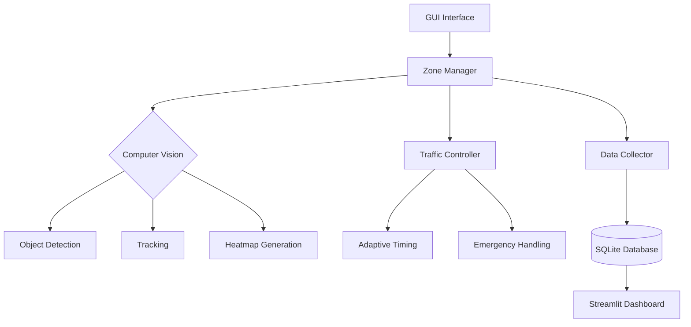

# **Traffic-Vision**  
**AI-Powered Traffic Monitoring and Signal Optimization System**

Traffic-Vision is an advanced AI solution designed to revolutionize urban traffic management. With real-time video analysis, dynamic traffic control, and automated emergency detection, it enhances road safety, optimizes traffic flow, and provides actionable insights through intuitive visualizations.


## **Overview**
Traffic-Vision integrates **computer vision**, **adaptive control systems**, and **IoT technologies** to create a comprehensive traffic management platform. It offers:  
- Real-time accident and emergency vehicle detection  
- Adaptive traffic light control based on live conditions  
- Heatmap-based congestion analysis  
- Custom monitoring zones for precise vehicle and pedestrian tracking  
- Automated Telegram notifications for incidents  


## Demo
[App Demo](https://github.com/user-attachments/assets/f4f07a78-00b7-4b57-b1fe-d37b438e5565)

[Dashboard Demo](https://github.com/user-attachments/assets/0a73d480-5c27-4696-8355-bfc90ba7772c)


## **Key Features**

### **Real-Time Traffic Analysis**
- Processes live video feeds to monitor traffic conditions.  
- Detects and classifies vehicles (cars, buses, trucks, bicycles, motorcycles).  
- Tracks pedestrians and estimates vehicle speed.  

### **Emergency Vehicle & Accident Detection**
- Specialized YOLOv8 models detect ambulances and fire trucks.  
- Automatically identifies and alerts on traffic accidents.  

### **Dynamic Traffic Control**
- Adjusts traffic light states based on real-time congestion.  
- Prioritizes emergency vehicles and accident-affected routes.  

### **Heatmap-Based Congestion Analysis**
- Generates visual heatmaps to display traffic density.  
- Customizable parameters: color, intensity, decay rate.  

### **Automated Notifications**
- Sends real-time alerts for accidents and emergencies via Telegram.  

### **Data Collection & Storage**
- Collects and stores traffic metrics in an SQLite database.  
- Enables historical analysis and reporting.  


## **Tech Stack**

### **Machine Learning**
- **YOLOv8m**: Object detection for vehicles, pedestrians, and incidents.  

### **Backend**
- **PyQt6**: Graphical user interface.  
- **SQLite**: Database for storing traffic metrics.  
- **Streamlit**: Data visualization and analytics dashboard.  

### **Hardware Simulation**
- **Arduino (C++)**: Real-time traffic light simulation.  

### **Messaging**
- **Telegram Bot**: Automated accident notifications.  

### **Visualization**
- Heatmaps, real-time dashboards, and detailed analytics.  


## **System Architecture**



## **Recommended Hardware**

### Processor Graphics
- **NVIDIA GPU**
  - Minimum CUDA version: 12.4
  - Recommended models: Entry-level NVIDIA GPUs supporting CUDA 12.4

### Alternative Graphics
- **Apple M2 Chip**
  - Native GPU acceleration
  - Integrated into Apple Silicon devices

### Memory
- **Minimum RAM**: 8 GB
- Recommended for optimal performance: 16 GB or higher

### Software Requirements
- **Python Version**: 3.9 or newer
- Compatibility with latest Python releases preferred

### Notes
- These are minimum specifications
- Higher-end hardware will provide better performance
- Ensure GPU drivers are up to date
- Verify Python environment meets version requirements
  

## **Installation & Setup**

### **Environment Setup**
```bash
# Clone the repository
git clone https://github.com/Wydoinn/Traffic-Vision.git
cd Traffic-Vision

# Install dependencies
pip install -r requirements.txt
```


### **Run the Application**
```bash
# Start the Traffic Vision Application
python app.py

# Launch the Analytics Dashboard
streamlit run visualizer.py
```


## **Usage Guide**

### **Model Configuration**
1. Open the **Settings** tab.  
2. Configure model paths:  
   - **Object Detection Model** (vehicles & pedestrians)  
   - **Emergency Vehicle Detection Model**  
   - **Accident Detection Model**  
3. Adjust confidence thresholds and IoU settings.  

### **Creating Monitoring Zones**
1. Select a video source with the **Select Video** button.  
2. Define monitoring zones:  
   - Click **Create Vehicle Zones** → draw on the video frame.  
   - Press **Enter** to save, **Esc** to cancel, **Backspace** to remove the last point.  
3. Repeat for pedestrian zones.  
4. Save zone configurations for future sessions.  

### **Running Inference**
1. Click **Start Inference** after configuring zones.  
2. View live video feed with annotations, including:  
   - Real-time vehicle and pedestrian counts.  
   - Dynamic heatmaps showing congestion.  
   - Emergency vehicle and accident alerts.  

### **Traffic Light Management**
1. Go to the **Traffic Lights** tab.  
2. Configure traffic light positions and logic.  
3. Toggle the display of simulated traffic lights.  
4. The system automatically adjusts traffic lights based on:  
   - Zone-specific congestion levels.  
   - Emergency vehicle detection.  
   - Accident alerts.  

### **Monitoring Dashboard**
The **Monitoring** tab displays:  
- Real-time vehicle and pedestrian counts by zone.  
- Emergency vehicle indicators.  
- Accident alerts and timestamps.  
- Traffic light status and transitions.  


## **Project Structure**

```
📂 Traffic-Vision
 ┣ 📁 configs              # Configuration files  
 ┣ 📁 controller           # Traffic light control logic  
 ┣ 📁 data                 # Traffic data 
 ┣ 📁 db                   # SQLite database interaction
 ┣ 📁 hardware_simulation  # SQLite database interaction
 ┣ 📁 models               # Training results
 ┣ 📁 static               # UI assets and styling  
 ┣ 📁 ui                   # User interface components  
 ┣ 📁 utils                # Utility functions
 ┣ 📁 visualizations       # Trained model visualization 
 ┣ 📄 app.py               # Application initialization  
 ┣ 📄 config_manager.py    # Configuration handling  
 ┣ 📄 inference.py         # Video processing and inference  
 ┣ 📄 logger.py            # Application logging  
 ┣ 📄 main.py              # Main UI window  
 ┣ 📄 manager.py           # Zone management & analysis  
 ┣ 📄 version.py           # Version tracking  
 ┣ 📄 visualizer.py        # Streamlit visualization  
 ```


## **AI Models**

Traffic-Vision uses three YOLOv8m models:  

1. **Object Detection Model:** Detects vehicles and pedestrians.  
2. **Emergency Vehicle Model:** Identifies ambulances and fire trucks.  
3. **Accident Detection Model:** Recognizes accidents and incidents.  

Supported formats:  
- **PyTorch (.pt)**  
- **CoreML (.mlpackage)** → Optimized for Apple Silicon  
- **ONNX (.onnx)**  
- **TensorRT (.engine)**  


## **Configuration Options**

### **Inference Settings**
- **Confidence Threshold:** Detection confidence level.  
- **IoU Threshold:** Intersection-over-union for bounding boxes.  
- **Image Size:** Input image resolution.  
- **Precision:** Half precision (for GPU acceleration).  
- **Max Detections:** Limit for detections per frame.  
- **Video Stride:** Frame skipping for faster processing.  

### **Heatmap Settings**
- **Kernel Sigma:** Smoothing factor.  
- **Intensity Factor:** Heatmap brightness.  
- **Opacity:** Transparency level.  
- **Colormap:** Heatmap color scheme.  
- **Decay Rate:** Gradual fading of heatmap over time.  

### **Display Settings**
- **Aspect Ratio Mode:** Maintain aspect ratio for video feeds.  

### **Notification Settings**
- **Telegram API Token:** Bot authentication.  
- **Chat ID:** Recipient ID for alerts.  
- **Enable/Disable Notifications.**  


## **Data Collection**

Traffic-Vision automatically collects traffic data during inference, including:  
- Vehicle counts by type and zone.  
- Pedestrian counts by zone.  
- Emergency vehicle and accident events.  
- Traffic patterns over time.  

Data is stored in an SQLite database:  
```bash
/data/traffic_data.db
```


## **License**
This project is licensed under the **MIT License**.  
Feel free to use, modify, and distribute it.


**Traffic-Vision** — Transforming traffic management with AI-powered efficiency.
