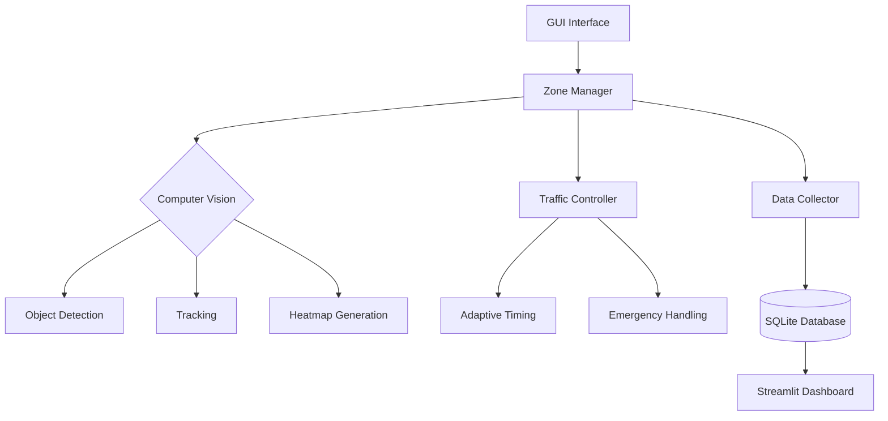

# 🚦 Traffic Vision

AI-Powered Traffic Monitoring System and Signal Optimization is at the core of Traffic-Vision, enabling advanced urban traffic management, real-time emergency detection, and traffic flow optimization. 

## 🌟 **Overview**
Traffic-Vision is a comprehensive AI-powered traffic management system that leverages computer vision, adaptive control systems to enhance road safety and optimize traffic flow, offering real-time accident detection, emergency vehicle prioritization, dynamic traffic light control, heatmap-based congestion analysis, and real-time video processing with custom monitoring zones, vehicle and pedestrian tracking, and anomaly detection. 

## 🔥 **Key Features**
- **Real-time Traffic Analysis**: Process video feeds to monitor traffic conditions in real-time
- **Custom Zone Definition**: Create and manage vehicle and pedestrian monitoring zones
- **Vehicle Detection & Classification**: Identify and classify different vehicle types (cars, buses, trucks, bicycles, motorcycles)
- **Speed Estimation**: Calculate and display vehicle speed based on tracking data
- **Emergency Vehicle Detection**: Identify emergency vehicles like ambulances and fire trucks
- **Accident Detection**: Automatically detect and alert on traffic accidents
- **Traffic Light Control**: Intelligent traffic light management based on traffic flow, emergency vehicles, and accidents
- **Traffic Heatmap Generation**: Visualize traffic density with customizable heatmaps
- **Data Collection & Storage**: Record and store traffic metrics in a SQLite database for later analysis
- **Telegram Notifications**: Send automated alerts when accidents are detected

## ⚙️ **Tech Stack**
- **ML Models:** YOLOv8 for real-time object detection.
- **Backend:** PyQt6 (GUI), SQLite (database), Streamlit (analytics).
- **Hardware Simulation:** Arduino (C++) for real-time traffic light simulation.
- **Messaging:** Telegram bot for accident notifications.
- **Visualization:** Heatmaps and analytics dashboards.

## 🛠️ **System Architecture**


## ⚙️ **Installation and Setup**
### 1️⃣ **Environment Setup**
```bash
# Clone the repository
git clone https://github.com/Wydoinn/Traffic-Vision.git
cd Traffic-Vision

# Install dependencies
pip install -r requirements.txt

# Recommended Hardware
- NVIDIA GPU with CUDA 11.8 or Apple M2
- 8GB+ RAM
- Python 3.9+
```

### 2️⃣ **Run the Application**
```bash
# Start the Traffic Management System
python main.py

# Launch the Analytics Dashboard
streamlit run visualizer.py
```

## Usage

### Setting Up Models

Before starting analysis:
1. Go to the **Settings** tab
2. Configure paths for the following models:
   - Object Detection Model (YOLO or equivalent)
   - Emergency Vehicle Detection Model
   - Accident Detection Model
3. Adjust confidence thresholds for each model as needed

### Creating Monitoring Zones

1. Select a video source using the **Select Video** button
2. Specify the number of vehicle and pedestrian zones
3. Click **Create Vehicle Zones** and define zones by clicking points on the video frame
4. Press Enter to complete a zone, Esc to cancel, Backspace to remove last point
5. Repeat for pedestrian zones if needed
6. Use **Save Zones** to store zone configurations for future use

### Running Inference

1. After setting up zones, click **Start Inference**
2. The application displays:
   - Main video feed with annotations
   - Traffic density heatmap
   - Vehicle counts by type and zone
   - Emergency vehicle and accident alerts

### Traffic Light Management

1. Navigate to the **Traffic Lights** tab
2. Configure traffic light positions and logic
3. Use the toggle button to display traffic lights on the video feed
4. The system automatically adjusts traffic light states based on:
   - Traffic density in each zone
   - Presence of emergency vehicles
   - Accident detection

### Monitoring Dashboard

The **Monitoring** tab provides:
- Real-time vehicle counts by zone and type
- Pedestrian counts
- Emergency vehicle indicators
- Accident alerts
- Traffic light status visualization

## Project Structure

- **app.py**: Application initialization and configuration
- **config_manager.py**: Settings and configuration management
- **inference.py**: Video processing and inference thread management
- **logger.py**: Application logging system
- **main.py**: Main application window and UI components
- **manager.py**: Zone management and traffic analysis logic
- **version.py**: Version tracking
- **visualizer.py**: Visualization utilities

### Directories:
- **configs/**: Application configuration files
- **controller/**: Traffic light control system
- **data/**: Traffic data storage and zone configurations
- **db/**: Database interaction for storing traffic metrics
- **models/**: Pre-trained ML models (CoreML and PyTorch formats)
- **static/**: UI assets and styling
- **ui/**: User interface components
- **utils/**: Utility functions and helpers

## AI Models
Traffic Vision uses the following models:

# Traffic-Vision Models

1. **Object Detection Model:** YOLOv8m model for detecting vehicles and pedestrians.
2. **Emergency Vehicle Model:** YOLOv8m specialized model for detecting ambulances and fire trucks.
3. **Accident Detection Model:** YOLOv8m custom model for identifying traffic accidents.

Models can be used in multiple formats:
- PyTorch (.pt)
- CoreML (.mlpackage) - optimized for Apple Silicon
- ONNX (.onnx)
- TensorRT (.engine)


## Configuration Options

### Inference Settings
- Confidence thresholds
- IoU thresholds
- Image size
- Half precision (for GPU acceleration)
- Maximum detections
- Video stride

### Heatmap Settings
- Kernel sigma
- Intensity factor
- Opacity
- Colormap
- Decay rate

### Display Settings
- Aspect ratio mode
- Frame rendering options

### Notification Settings
- Telegram API token
- Chat ID
- Notification enable/disable


## Data Collection

Traffic Vision automatically collects traffic data during inference, including:
- Vehicle counts by type and zone
- Pedestrian counts by zone
- Emergency vehicle detection events
- Accident detection events
- Traffic patterns over time
  

## 🤝 **Contributing**
Pull requests are welcome. For significant changes, please open an issue first to discuss what you would like to change.

## 📜 **License**
This project is licensed under the MIT License.
